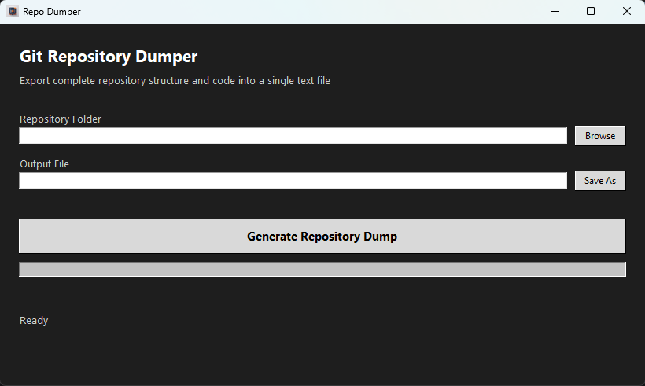
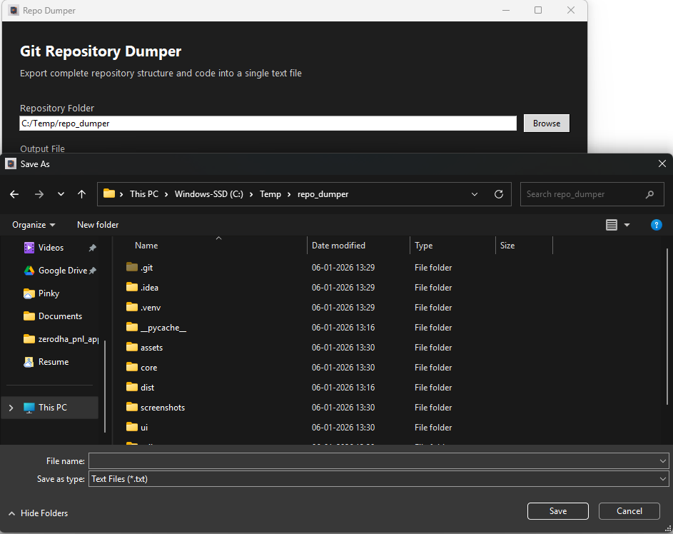
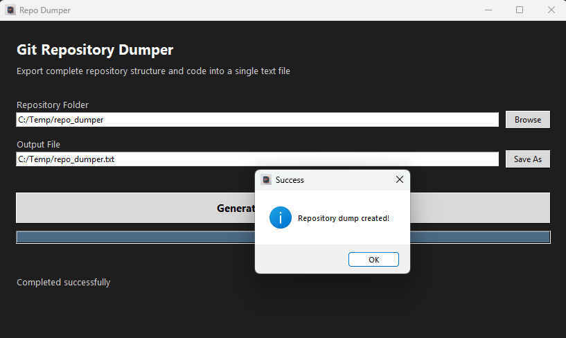

# Repo Dumper 🗂️

A **modern, GUI-based Python desktop tool** that exports an entire Git repository  
— **folder structure + source code** — into a **single, human-readable text file**,  
while **fully respecting `.gitignore` rules**.

Built for **developers, reviewers, auditors, and LLM workflows**.

---

## 🚀 Why Repo Dumper?

Large Language Models (LLMs) and offline reviewers work best when they receive:
- Full repository structure
- Complete source code
- Clean, predictable formatting
- No binary noise
- No accidental secrets

**Repo Dumper solves this cleanly and safely.**

---

## ✨ Key Features

### 📁 Repository Awareness
- Accurate recursive folder tree
- Clean, readable hierarchy
- Emoji-enhanced structure output

### 🧠 Git-Smart Ignoring
- Fully honors `.gitignore` (including nested rules)
- Hard-excludes:
  - `.git`
  - `.idea`
  - `.venv`
  - `__pycache__`
- `.gitignore` is used for logic **but never dumped**

### 📄 Source Code Extraction
- Includes full content of all text-based files
- Skips:
  - Images
  - Media
  - Archives
  - Executables
  - Large files (>1 MB)
- Binary detection via:
  - File extension
  - Byte-level content sniffing

### 🖥️ Modern Desktop GUI
- Clean, dark-themed interface
- Built using **Tkinter + ttk**
- Non-blocking background processing
- Progress bar & live status updates

### 🔒 Safe by Design
- Ignored files are never read
- No `.git` metadata included
- Ideal for sharing with LLMs or external reviewers

---

## 📸 Screenshots

### Main Application Window


### Repository Selection


### Dump Completed

---

## 📂 Project Structure

```text
repo_dumper/
│
├── app.py                     # Application entry point
├── ui/
│   └── main_window.py         # GUI layer
├── core/
│   ├── scanner.py             # Repository traversal & ignore logic
│   └── writer.py              # Output formatting
├── utils/
│   └── file_utils.py          # Binary & size detection helpers
├── assets/
│   └── repo_dumper.ico
├── requirements.txt
└── README.md
```

---

## 🛠️ Installation

### Clone the repository
```bash
git clone https://github.com/your-username/repo_dumper.git
cd repo_dumper
```

### Install dependencies
```bash
pip install -r requirements.txt
```

> Only one external dependency: **pathspec**

---

## ▶️ Usage

```bash
python app.py
```

### Steps
1. Select the Git repository folder
2. Choose the output `.txt` file
3. Click **Generate Repository Dump**
4. Done 🎉

---

## 📦 Output Format

The generated text file contains:
1. Repository Structure
2. Full Source Code Contents
3. Execution Summary

---

## 🧠 Ideal Use Cases

- Sharing repositories with LLMs (ChatGPT, Claude, Gemini)
- Code reviews & audits
- Documentation snapshots
- Offline repository analysis
- Secure repo handovers

---

## 🔮 Future Enhancements

- Live file-by-file progress tracking
- Dump preview before export
- Markdown / JSON output formats
- Configurable ignore rules
- Theme switch (Light/Dark)

---

## 📜 License

This project is licensed under the **MIT License**.

✔️ Free for personal and not commercial use  
✔️ Modification and redistribution permitted  
✔️ No warranty provided  

---

## 👨‍💻 Author

Built with ❤️ by **Chetan** 

Focused on developer tooling, clarity, and productivity.
